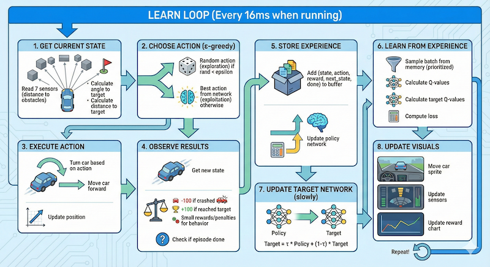

# Neural network based Reinforcement Learning [ To Drive a car in a city map]

## Demo 
[YouTube Link](https://youtu.be/cPFR4THke-U?si=UHgx4iVQxtIxbUWX)

## Description
### Training Loop

### Neural Network
A simple Feed-Forward Neural Network (MLP) that takes 9 inputs and produces 5 outputs:

- **Inputs:** 7 sensor readings (brightness of pixels ahead) + Angle to target + Distance to target.
- **Outputs:** Q-values for 5 actions: Left, Straight, Right, Sharp Left, Sharp Right.

**Architecture**
```
Input (9 features)
    │
    ▼
[128 neurons] ← First hidden layer
    │ ReLU
    ▼
[256 neurons] ← Wider layer (pattern recognition)
    │ ReLU
    ▼
[256 neurons] ← Maintains capacity
    │ ReLU
    ▼
[128 neurons] ← Narrows down
    │ ReLU
    ▼
Output (5 Q-values, one per action)
```

### CarBrain class

This class manages the logic:

`get_state()`
- Simulates "ray casting" sensors to see walls (dark pixels) or open space (light pixels).

`step(action)`
- Moves the car based on physics and calculates the reward:
- +100: Reached target.
- -100: Crashed (drove effectively into a wall).
- -0.1: Small penalty for every second alive (incentivizes speed).
- Shaping: Small points for getting closer to the target.

`optimize()`
- The learning step. It samples past experiences from memory and trains the neural network to predict better Q-values. It uses a Dual Memory system (prioritizing successful episodes) to speed up learning.

## Prerequisites
- Python 3.x installed

## Installation

1. Create a virtual environment:
   ```bash
   python3 -m venv venv
   ```

2. Activate the virtual environment:
   - **Mac/Linux:**
     ```bash
     source venv/bin/activate
     ```
   - **Windows:**
     ```bash
     venv\Scripts\activate
     ```

3. Install dependencies:
   ```bash
   pip install -r requirements.txt
   ```

## Running the Application

1. Make sure your virtual environment is activated.
2. Run the assignment script:
   ```bash
   python citymap_assignment.py
   ```
3. Load the image.
4. Place the car and targets.